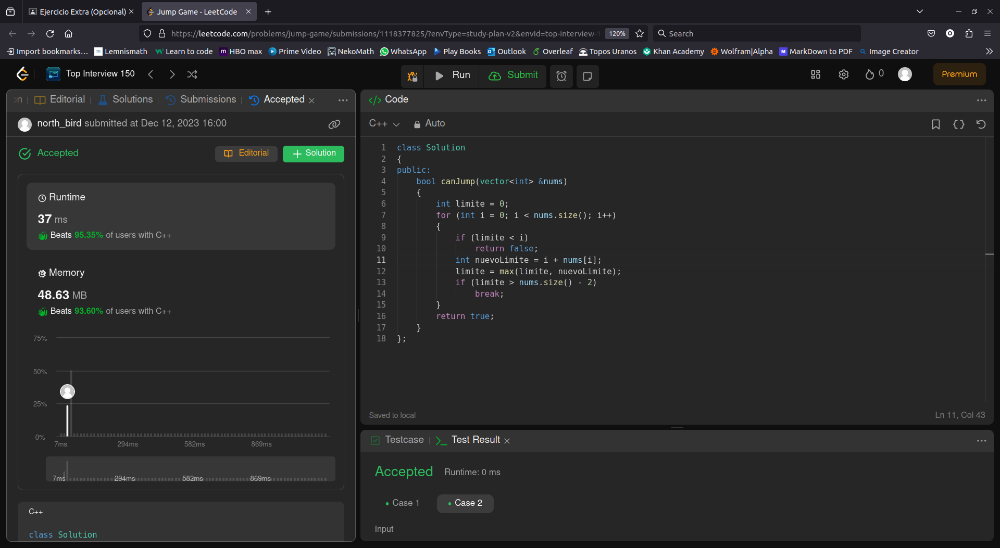

# Problema Extra de laboratorio de Modelado y Programación

Alumno: Luis Norberto López García

Número de Cuenta: 423092075

## Lenguaje y ejecución.
Se ocupó C++ para resolver el problema y resultó ser muy rápida la implementación y con buen uso de memoria.

Se hizo un método `main` para realizar las pruebas que da LeetCode. 
Para ejecutar el programa sólo basta con escribir los siguientes comandos en el directorio donde se encuentra el archivo `Solution.cpp`:

```
g++ -o Solution Solution.cpp 
./Solution 
```

Y debería mostrar el siguiente resultado:

```
C++ interpreta a False como 0 y a True como 1:
Prueba 1: nums = [2,3,1,1,4]
Resultado: 1
Prueba 2: nums = [3,2,1,0,4]
Resultado: 0
```

## Resolución del problema.

El método para resolverlo tiene la siguiente firma:
```c++
public: 
    /**
     * Dado un arreglo de enteros sin números negativos, determinar si dando
     * a lo mucho nums[i] saltos, se puede llegar al final del arreglo.
     *
     * @param nums arreglo de enteros sin números negativos
     * @return 1 si es posible recorrer todo el arreglo, 0 en otro caso.
     *
     */
    bool canJump(vector<int> &nums)
    { 
        ...
    }
```
A partir del número que esté en la primera posición del arreglo, ese número representa el número máximo de pasos que podemos avanzar a través del arreglo a partir de ese índice y así con todos los índices en el alcance del primer número, se tiene que determinar si es posible seguir avanzando hasta el final del arreglo.

Primero se inicializa una variable llamada `limite` que representará el índice máximo que se puede alcanzar. 

Posteriormente se entra en un ciclo que pretende iterar sobre el arreglo, para la primera instrucción dentro del ciclo se checa si el límite hasta el cual se puede llegar es mayor o igual que el índice en el que estamos, si es menor, esto significa que es inalcanzable, entonces también lo es el último elemento del arreglo, por lo tanto se regresa `false`.

Si pasa este `if`, asignamos el valor a una nueva variable como `nuevoLimite`, que representa los pasos que puede alcanzar a partir de ese índice, actualizamos el valor de la variable `limite` como el alcance máximo entre el límite anterior con el nuevo límite, ya que a veces puede resultar que el nuevo límite sea menor que el límite anterior y podríamos perder *alcance*. Finalmente, puede que nuestro límite ya haya sobrepasado el índice del último elemento sin haber recorrido todo el arreglo, para darle una ligera optimización podemos romper el ciclo.

Para esto, si se pudo recorrer todo el arreglo o si entró en el segundo `if`, significa que el último elemento del arreglo se puede alcanzar, por lo tanto se devuelve `true`.


## Aprobación en Leet Code
Finalmente, aquí está la captura de pantalla del código aprobado en Leet Code, también se puede consultar la imagen en la carpeta `images/` para una mejor visualización.

