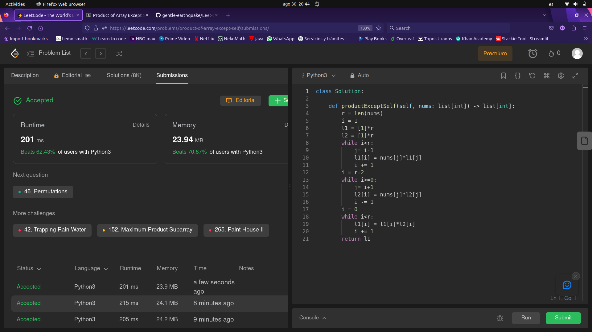

# Problema 1 de laboratorio de Modelado y programación.

Alumno: Luis Norberto López García

Número de Cuenta: 423092075

## Lenguaje y ejecución.
Para resolverlo utilicé Python, para su ejecución en la terminal, la instrucción se debe escribir dentro de la dirección del archivo de la siguiente manera:

```
python3 Solution04.py
```
Debería mostrar como resultado algo parecido a esto, primero el arreglo con el que se hizo una prueba para verificar que el código funciona y el segundo arreglo impreso es la salida del programa que se comporta como lo esperado.
```
Original array:
 [2, 4, -6, 8]

Array product except self:
 [-192, -96, 64, -48]

```
## Resolución del problema.
Todo el problema se resuelve en el mismo método 
```python
 def productExceptSelf(self, nums: list[int]) -> list[int]:
 ```
El cuerpo del método empieza con declaración de variables auxiliares; el tamaño del arreglo de `nums`, un índice para iterar sobre arreglos y dos arreglos auxiliares del tamaño de `nums`.

Tamaño del arreglo
```python
    r = len(nums)
```
Índice para iterar sobre arreglos
```python
    i = 1
```
Dos arreglos de tamaño `r` y con elementos neutros multiplicativos para que no haga ruido.
```python
    l1 = [1]*r
    l2 = [1]*r
```
En el arreglo `l1` se va a llenar el producto de todos los elementos anteriores a cada posición, teniendo un caso especial en la primera entrada que naturalmente debe ser `1`, ejemplo:
$$nums=[x,y,z,u]$$
$$l1 = [1,x,xy,xyz]$$
En código este procedimiento queda de la siguiente manera:
```python 
    while i < r:
        j = i-1
        l1[i] = nums[j]*l1[j]
        i += 1
```
Después de eso se actualiza el valor de i para la siguiente iteración:
```python
    i = r-2
```
De manera similar, en el arreglo `l2` se llena el prodcuto de todos los elementos posteriores a cada posición, teniendo el caso especial en la última entrada que es `1`, ejemplo:
$$nums=[x,y,z,u]$$
$$l2=[yzu,zu,u,1]$$
En código este procedimiento queda de la siguiente manera:
```python
    while i >= 0:
        j = i+1
        l2[i] = nums[j]*l2[j]
        i -= 1
```
Después de eso se actualiza el valor de i para la siguiente iteración:
```python
    i = 0
```
Posteriormente se multiplican los elementos que comparten el mismo índice en sus respectivos arreglos y se sobreescribe ese producto en el arreglo $l1$, ejemplo:
$$l1 = [1,x,xy,xyz]$$
$$l2=[yzu,zu,u,1]$$
$$merge = [yzu,xzu,xyu,xyz]$$
En código este procedimiento queda de la siguiente manera:
```python
    while i < r:
        l1[i] = l1[i]*l2[i]
        i += 1
```
Por útlimo se regresa el arrelgo `l1`.
```python
    return l1
```
Y así es como termina el método. $\square$

## Otros caminos.
No fue la primera idea de solución del problema, los primeros bocetos consistían en utilizar el producto de todos los elementos del arreglo y usar una simulación de la división con definición recursiva, sin embargo no funciona muy bien ya que la pila de ejecución se satura con tantas llamadas recursivas. 

Otra propuesta anterior fue usar la concatenación de listas en vez de usar los índices de los arreglos, pero esto igual que la división recursiva, sólo llevó a una solución lenta y que ocupaba mucha memoria.

Aquí está una solución totalmente funcional en `Haskell` del mismo problema con practicamente todas las funciones recursivas menos el de valor absoluto: 
```haskell
abso :: Int -> Int 
abso n = if (n<0) then -n else n

divi :: Int -> Int -> Int
divi n m =  if ((abso n) > (abso m))
            then 0
            else 1 + divi (abso n) ((abso m) - (abso n))

producto :: [Int] -> Int
producto [] = 1
producto (x:xs) = x * producto (xs)

answer :: [Int] -> Int -> [Int]
answer [] p = []
answer (x:xs) p = [divi x p] ++ answer xs p

main = do
    let l = [1,2,3,(-4),5,6]
    let p = producto l
    putStrLn "Array Product Except Self"
    print (l)
    print (answer l p)
```
## Aprobación en Leet Code
Finalmente, aquí está la captura de pantalla del código aprobado en Leet Code, también se puede consultar la imagen en la carpeta `images/` para una mejor visualización.



