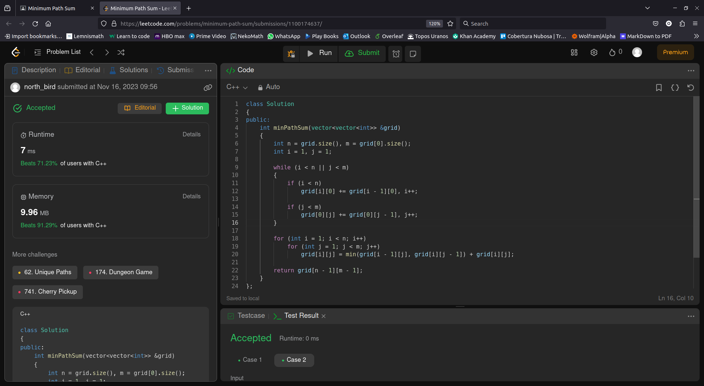

# Problema 4 de laboratorio de Modelado y Programación

Alumno: Luis Norberto López García

Número de Cuenta: 423092075

## Lenguaje y ejecución.
Se ocupó C++ para resolver el problema y resultó ser muy rápida la implementación y con buen uso de memoria.

Se hizo un método `main` para realizar las pruebas que da LeetCode. 
Para ejecutar el programa sólo basta con escribir los siguientes comandos en el directorio donde se encuentra el archivo `Solution.cpp`:

```
g++ -o Solution Solution.cpp 
./Solution 
```

Y debería mostrar el siguiente resultado:

```
Prueba 1: grid = [[1,3,1],[1,5,1],[4,2,1]]
Resultado: 7
Prueba 2: grid = [[1,2,3],[4,5,6]]
Resultado: 12
```

## Resolución del problema.

El método para resolverlo tiene la siguiente firma:
```c++
public: 
    /**
     * Método que devuelve la distancia mínima de un arreglo al recorrerlo de la esquina superior izquierda hasta la esquina inferior derecha.
     *
     * @param grid la matriz con cada elemento como la distancia que hay entre el anterior superior o izquierdo.
     * @return el valor de la trayectoría de distancia mínima.
     *
     */
    int minPathSum(vector<vector<int>> &grid)
    { 
        ...
    }
```
Donde a partir del arreglo `grid` podemos obtener el resultado de salida.

Primero se llenaron la primer fila y la primer columna de izquierda a derecha y de arriba para abajo, posteriormente se fueron actualizando los valores de los demás elementos del arreglo con el mínimo de sus vecinos previamente alterados.

De esta manera, la esquina inferior derecha será igual a la trayectoría de distancia mínima del valor `[0][0]`.

## Aprobación en Leet Code
Finalmente, aquí está la captura de pantalla del código aprobado en Leet Code, también se puede consultar la imagen en la carpeta `images/` para una mejor visualización.

