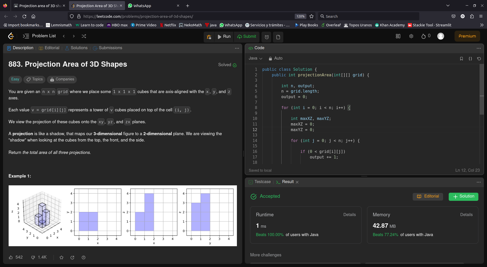

# Problema 2 de laboratorio de Modelado y Programación

Alumno: Luis Norberto López García

Número de Cuenta: 423092075

## Lenguaje y ejecución.
Se ocupó Java para resolver el problema y resultó ser muy rápida la implementación a pesar de que el espacio en memoria si fue algo grande.

Se hizo un método `main` para realizar las pruebas que da LeetCode. 
Para ejecutar el programa sólo basta con escribir los siguientes comandos en el directorio donde se encuentra el archivo `Solution.java`:

```
javac Solution.java
java Solution
```

Y debería mostrar el siguiente resultado:

```
test 1, [[1,2][3,4]]: 17
test 2, [[2]]: 5
test 3, [[1,0],[0,2]]: 8
```

## Resolución del problema.

El método para resolverlo tiene la siguiente firma:
```java
    /**
     * Regresa el área de la suma de las 3 proyecciones bidimensionales de una
     * figura hecha de cuadros de 1x1x1
     * 
     * @param grid Descripción en una matriz de los cuadros de 1x1x1
     * @return Suma de las áreas
     */
    public int projectionArea(int[][] grid) {
        ...
    }
```
Donde a partir de `grid` podemos obtener el resultado de salida.

Después de analizarlo y hacer varias pruebas, podemos notar que el área no es mas que la suma de los siguientes 3 números:

- El número de elementos en `grid` diferentes a 0.
- La suma de los elementos máximos de cada fila.
- La suma de los elementos máximos de cada columna.

Y de esta manera con una sóla iteración por todo el arreglo podemos obtener dicha área.

## Aprobación en Leet Code
Finalmente, aquí está la captura de pantalla del código aprobado en Leet Code, también se puede consultar la imagen en la carpeta `images/` para una mejor visualización.

