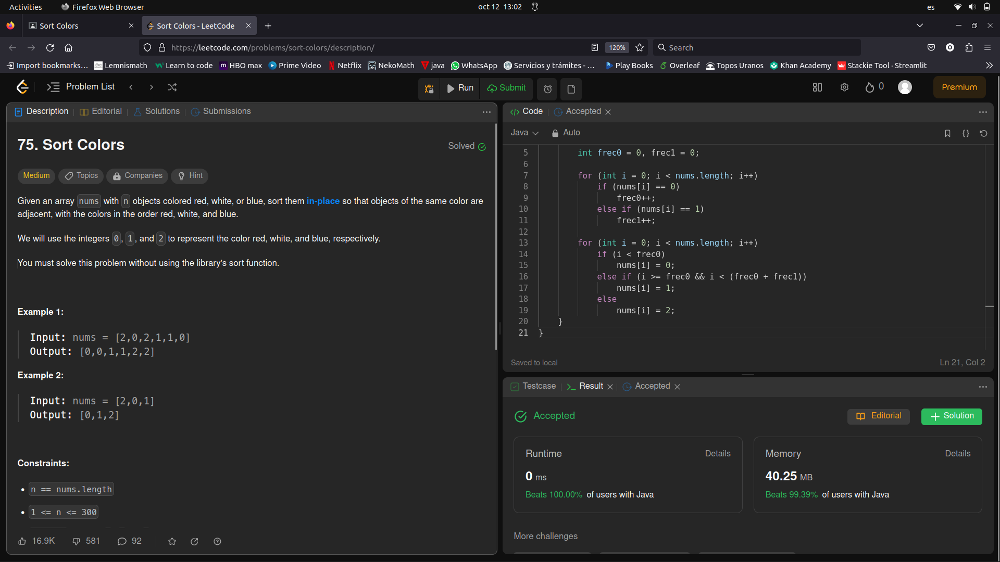

# Problema 3 de laboratorio de Modelado y Programación

Alumno: Luis Norberto López García

Número de Cuenta: 423092075

## Lenguaje y ejecución.
Se ocupó Java para resolver el problema y resultó ser muy rápida la implementación a pesar de que el espacio en memoria si fue algo grande.

Se hizo un método `main` para realizar las pruebas que da LeetCode. 
Para ejecutar el programa sólo basta con escribir los siguientes comandos en el directorio donde se encuentra el archivo `Solution.java`:

```
javac Solution.java
java Solution
```

Y debería mostrar el siguiente resultado:

```
Test 1: [2,0,2,1,1,0]
Índice 0:
[ ROJO ROJO AZUL BLANCO BLANCO ROJO ]

Índice 1:
[ ROJO ROJO AZUL BLANCO BLANCO ROJO ]

Índice 2:
[ ROJO ROJO BLANCO BLANCO BLANCO ROJO ]

Índice 3:
[ ROJO ROJO BLANCO BLANCO BLANCO ROJO ]

Índice 4:
[ ROJO ROJO BLANCO BLANCO AZUL ROJO ]

Índice 5:
[ ROJO ROJO BLANCO BLANCO AZUL AZUL ]

Test 2: [2,0,1]
Índice 0:
[ ROJO ROJO BLANCO ]

Índice 1:
[ ROJO BLANCO BLANCO ]

Índice 2:
[ ROJO BLANCO AZUL ]
```

Desde la terminal debe verse con colores.

## Resolución del problema.

El método para resolverlo tiene la siguiente firma:
```java
    /**
     * Regresa un arreglo ordenando con elementos del 0 al 2 con Counting Sort.
     * 
     * @param nums el arreglo a ordenar
     */
    public void sortColors(int[] nums) {
        ...
    }
```
Donde a partir de `nums` podemos obtener el resultado de salida.

Sólo es necesario ordenar los elementos, para esto se ocupó el algoritmo Counting Sort ya que el valor de los elementos está acotado únicamente 3 valores: {0,1,2}.

## Aprobación en Leet Code
Finalmente, aquí está la captura de pantalla del código aprobado en Leet Code, también se puede consultar la imagen en la carpeta `images/` para una mejor visualización.

